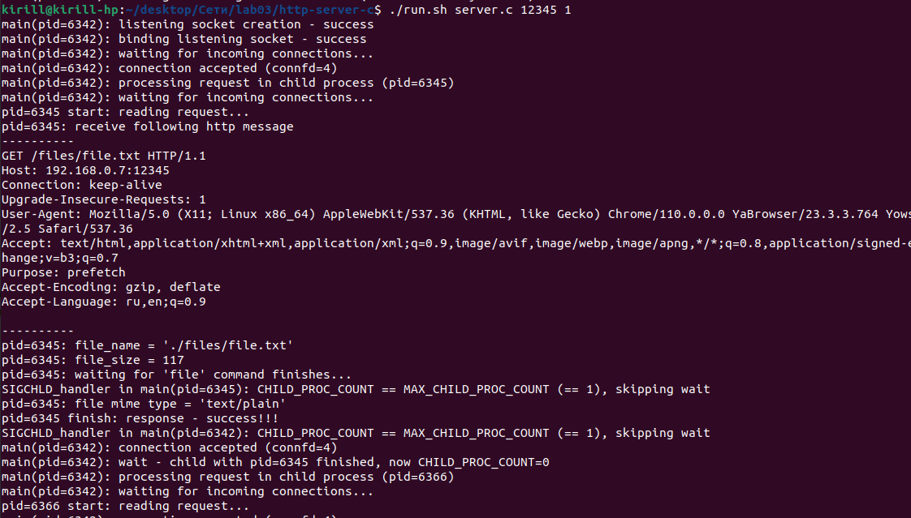
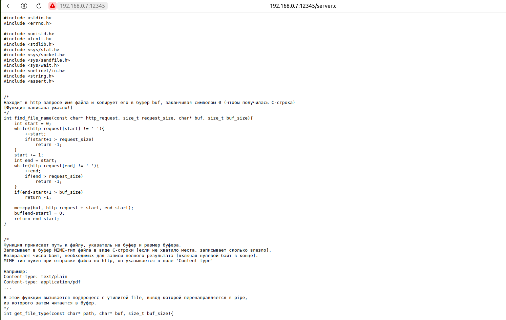

# Практика 3. Прикладной уровень

## Программирование сокетов. Веб-сервер

### А. Однопоточный веб-сервер (3 балла)
Вам необходимо разработать простой веб-сервер, который будет возвращать содержимое
локальных файлов по их имени. В этом задании сервер умеет обрабатывать только один запрос и
работает в однопоточном режиме. Язык программирования вы можете выбрать любой.
Требования:
- веб-сервер создает сокет соединения при контакте с клиентом (браузером) получает HTTP-запрос из этого соединения
- анализирует запрос, чтобы определить конкретный запрашиваемый файл
- находит запрошенный файл в своей локальной файловой системе
- создает ответное HTTP-сообщение, состоящее из содержимого запрошенного файла и предшествующих ему строк заголовков
- отправляет ответ через TCP-соединение обратно клиенту
- если браузер запрашивает файл, которого нет на веб-сервере, то сервер должен вернуть сообщение об ошибке «404 Not Found»

Ваша задача – разработать и запустить свой локальный веб-сервер, а затем проверить его
работу при помощи отправки запросов через браузер. Продемонстрируйте работу сервера, приложив скрины.

Скорее всего порт 80 у вас уже занят, поэтому вам необходимо использовать другой порт для
работы вашей программы.

Формат команды для запуска сервера:
```
<server.exe> server_port
```

#### Демонстрация работы
Сервер работает только на linux.

Зависимости: только стандартная библиотека C и утилита file (/bin/file).

Компиляция + запуск [следует вызывать из директории http-server-c]: 
```
./run.sh server.c server_port concurrency_level
```

Сервер при отправке файла также определяет его MIME-тип (с помощью утилиты file) и записывает в поле content-type.

Так выглядит запус сервера:


В директории http-server-c/files лежат файлы, на которых я тестировал сервер.
Вот как они выглядят из браузера:


А вот код сервера, отправленный им самим браузеру:


### Б. Многопоточный веб-сервер (2 балла)
Реализуйте многопоточный сервер, который мог бы обслуживать несколько запросов
одновременно. Сначала создайте основной поток (процесс), в котором ваш модифицированный
сервер ожидает клиентов на определенном фиксированном порту. При получении запроса на
TCP-соединение от клиента он будет устанавливать это соединение через другой порт и
обслуживать запрос клиента в отдельном потоке. Таким образом, для каждой пары запрос-ответ
будет создаваться отдельное TCP-соединение в отдельном потоке.

### В. Клиент (2 балла)
Вместо использования браузера напишите собственный HTTP-клиент для тестирования вашего
веб-сервера. Ваш клиент будет поддерживать работу с командной строкой, подключаться к
серверу с помощью TCP-соединения, отправлять ему HTTP-запрос с помощью метода GET и
отображать ответ сервера в качестве результата. Клиент должен будет в качестве входных
параметров принимать аргументы командной строки, определяющие IP-адрес или имя сервера,
порт сервера и имя файла на сервере. Продемонстрируйте работу клиента, приложив скрины. 

Формат команды для запуска клиента:
```
<client.exe> server_host server_port filename
```

#### Демонстрация работы
Клиент работает только на linux.

Компиляция + запуск [следует вызывать из директории http-server-c]: 
```
./run.sh client.c server_host server_port filename
```

Клиент работает корректно, только если ему в ответ отправлено ровно одно сообщение http, и его длина меньше чем 1500 байт.

Так выглядит запуск клиента:


### Г. Ограничение потоков сервера (3 балла)
Пусть ресурсы вашего сервера ограничены и вы хотите контролировать максимальное количество
потоков, с которыми может работать ваш многопоточный сервер одновременно. При запуске
сервер получает целочисленное значение `concurrency_level` из командной строки. Если сервер 
получает запрос от клиента, и при этом уже запущено максимальное количество потоков, то 
запрос от клиента блокируется (встает в очередь) и дожидается, пока не закончит работу 
один из запущенных потоков. После этого сервер может запустить новый поток для обработки 
запроса от клиента.

Формат команды для запуска сервера:
```
<server.exe> server_port concurrency_level
```