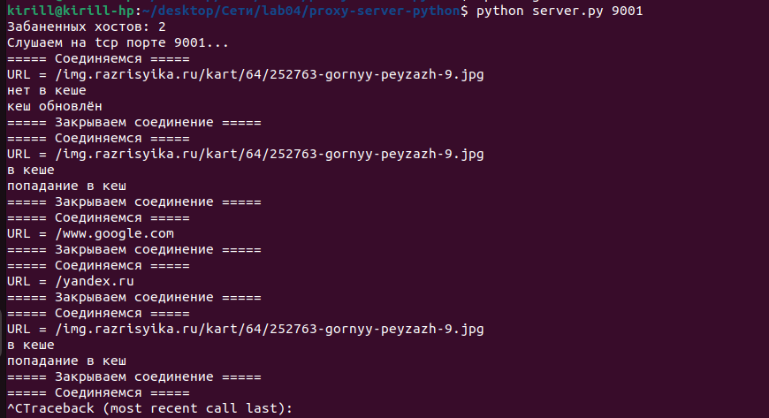
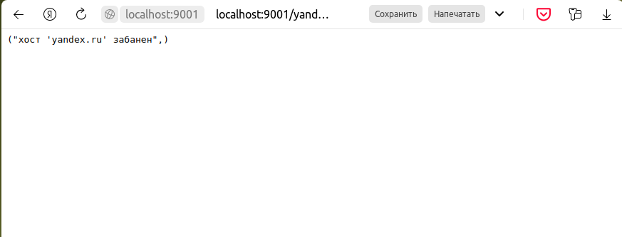
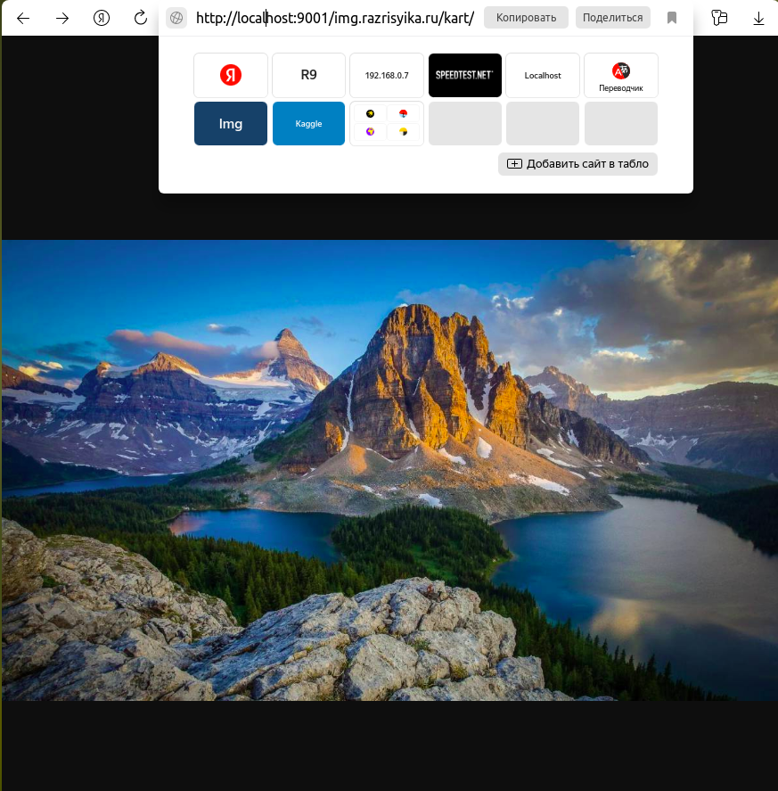

# Практика 4. Прикладной уровень

## Описание моего прокси-сервера

Это было очень сложное задание, я потратил на него больше недели :(

Сначала я пытался сделать его на C, как и прошлую лабу, но погряз в работе со строками и бросил это болото.
В данный момент сервер на C не запускается, однако в какое-то время он успешно пересылал запросы и ответы (без кеширования).

В итоге написал прокси сервер на питоне.

Запуск сервера (из директории proxy-server-python):
```
python server.py 9001
```

В файл banned_hosts.txt можно писать забаненные хосты: каждый на новой строке, в конце новой строки нет.
В файл logs.txt пишутся краткие логи о попаданиях и промахах в кеш и об обращении к забаненным хостам.
Сервер хранит кеш в директории server-cache.

Обращаться к серверу из браузера следует так: 
http://localhost:{порт}/{хост}/{файл на хосте}, например http://localhost:8888/www.google.com
или http://localhost:9001/img.razrisyika.ru/kart/64/252763-gornyy-peyzazh-9.jpg

Сервер получает запрос по http, а обращается к серверам по https.
От серверов требуется, чтобы они высылали следующие заголовки: 'Last-Modified', 'ETag', 'Content-Type'; иначе прокси выдаст ошибку!

В директории proxy-server-python также присутствует файл client.py, который умеет делать https GET запросы; 
я тестировал на нём библиотеки, он не относится к лабе напрямую.

### Демонстрация работы

Логи из logs.txt:
```
Слушаем на tcp порте 9001...
кеш обновлён:    URL = '/img.razrisyika.ru/kart/64/252763-gornyy-peyzazh-9.jpg'
попадание в кеш: URL = '/img.razrisyika.ru/kart/64/252763-gornyy-peyzazh-9.jpg'
хост 'www.google.com' забанен
хост 'yandex.ru' забанен
попадание в кеш: URL = '/img.razrisyika.ru/kart/64/252763-gornyy-peyzazh-9.jpg'
```

Скрин терминала:


Скрины из браузера:




## [УСЛОВИЕ ЛАБЫ] Программирование сокетов: Прокси-сервер
Разработайте прокси-сервер для проксирования веб-страниц. 
Приложите скрины, демонстрирующие работу прокси-сервера. 

### Запуск прокси-сервера
Запустите свой прокси-сервер из командной строки, а затем запросите веб-страницу с помощью
вашего браузера. Направьте запросы на прокси-сервер, используя свой IP-адрес и номер порта.
Например, http://localhost:8888/www.google.com

_(*) Вы должны заменить стоящий здесь 8888 на номер порта в серверном коде, 
то есть тот, на котором прокси-сервер слушает запросы._

Вы можете также настроить непосредственно веб-браузер на использование вашего прокси сервера. 
В настройках браузера вам нужно будет указать адрес прокси-сервера и номер порта,
который вы использовали при запуске прокси-сервера (опционально).

### А. Прокси-сервер без кеширования (4 балла)
1. Разработайте свой прокси-сервер для проксирования http GET запросов от клиента веб-серверу 
   с журналированием проксируемых HTTP-запросов. В файле журнала сохраняется
   краткая информация о проксируемых запросах (URL и код ответа). Кеширование в этом
   задании не требуется. **(2 балла)**
2. Добавьте в ваш прокси-сервер обработку ошибок. Отсутствие обработчика ошибок может
   вызвать проблемы. Особенно, когда клиент запрашивает объект, который не доступен, так
   как ответ 404 Not Found, как правило, не имеет тела, а прокси-сервер предполагает, что
   тело есть и пытается прочитать его. **(1 балл)**
3. Простой прокси-сервер поддерживает только метод GET протокола HTTP. Добавьте
   поддержку метода POST. В запросах теперь будет использоваться также тело запроса
   (body). Для вызова POST запросов вы можете использовать Postman. **(1 балл)**

Приложите скрины или логи работы сервера.

#### Демонстрация работы
todo

### Б. Прокси-сервер с кешированием (4 балла)
Когда прокси-сервер получает запрос, он проверяет, есть ли запрашиваемый объект в кэше, и,
если да, то возвращает объект из кэша без соединения с веб-сервером. Если объекта в кэше нет,
прокси-сервер извлекает его с веб-сервера обычным GET запросом, возвращает клиенту и
кэширует копию для будущих запросов.

Для проверки того, прокис объект в кеше или нет, необходимо использовать условный GET
запрос. В таком случае вам необходимо указывать в заголовке запроса значение для If-Modified-Since и If-None-Match. 
Подробности можно найти [тут](https://ruturajv.wordpress.com/2005/12/27/conditional-get-request).

Будем считать, что кеш-память прокси-сервера хранится на его жестком диске. Ваш прокси-сервер
должен уметь записывать ответы в кеш и извлекать данные из кеша (т.е. с диска) в случае
попадания в кэш при запросе. Для этого необходимо реализовать некоторую внутреннюю
структуру данных, чтобы отслеживать, какие объекты закешированы.

Приложите скрины или логи, из которых понятно, что ответ на повторный запрос был взят из кэша.

#### Демонстрация работы
todo

### В. Черный список (2 балла)
Прокси-сервер отслеживает страницы и не пускает на те, которые попадают в черный список. Вместо
этого прокси-сервер отправляет предупреждение, что страница заблокирована. Список доменов
и/или URL-адресов для блокировки по черному списку задается в **конфигурационном файле**.

Приложите скрины или логи запроса из черного списка.

#### Демонстрация работы
todo

