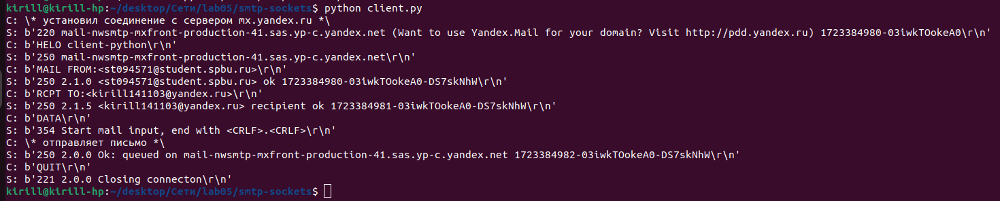
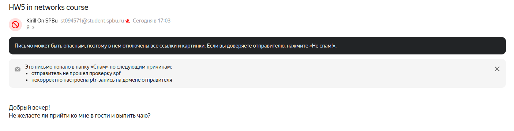
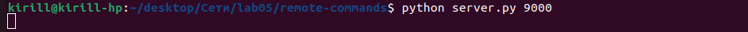
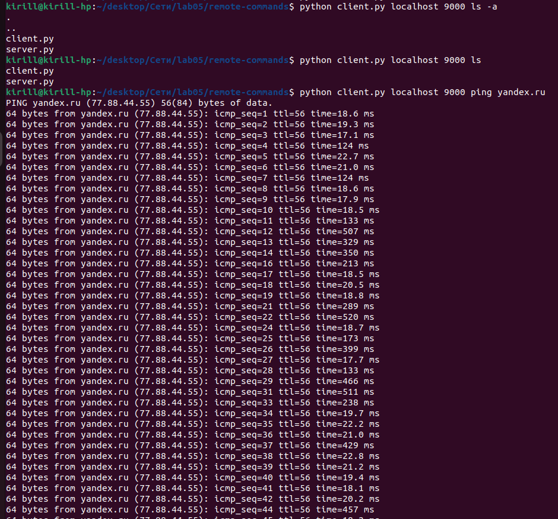
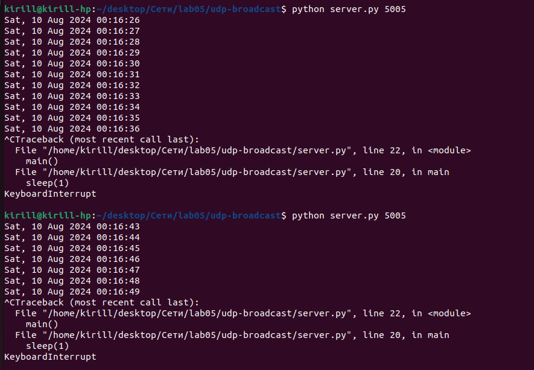
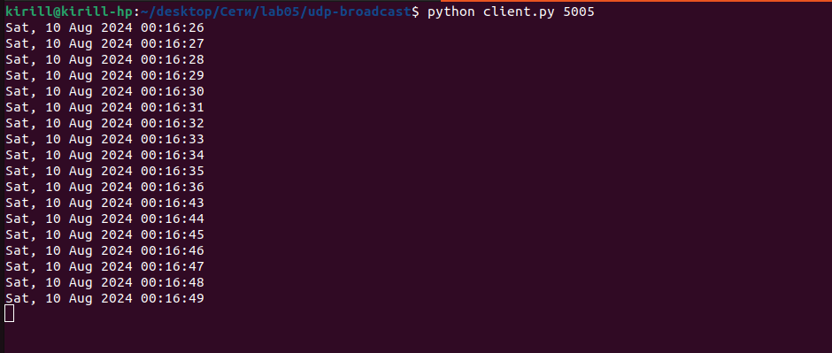

# Практика 5. Прикладной уровень

## Программирование сокетов.


Сделаны задания A.2 (SMTP-клиент), Б (Удаленный запуск команд) и В (Широковещательная рассылка через UDP).

### A. Почта и SMTP (7 баллов)

### 1. Почтовый клиент (2 балла)
Напишите программу для отправки электронной почты получателю, адрес
которого задается параметром. Адрес отправителя может быть постоянным. Программа
должна поддерживать два формата сообщений: **txt** и **html**. Используйте готовые
библиотеки для работы с почтой, т.е. в этом задании **не** предполагается общение с smtp
сервером через сокеты напрямую.

Приложите скриншоты полученных сообщений (для обоих форматов).

#### Демонстрация работы
todo

### 2. SMTP-клиент (3 балла)
Разработайте простой почтовый клиент, который отправляет текстовые сообщения
электронной почты произвольному получателю. Программа должна соединиться с
почтовым сервером, используя протокол SMTP, и передать ему сообщение.
Не используйте встроенные методы для отправки почты, которые есть в большинстве
современных платформ. Вместо этого реализуйте свое решение на сокетах с передачей
сообщений почтовому серверу.

Сделайте скриншоты полученных сообщений.

#### Демонстрация работы
Запуск скрипта, отправляющего письмо (из директории smtp-sockets):


Как оно выглядит в почте:


### 3. SMTP-клиент: бинарные данные (2 балла)
Модифицируйте ваш SMTP-клиент из предыдущего задания так, чтобы теперь он мог
отправлять письма с изображениями (бинарными данными).

Сделайте скриншот, подтверждающий получение почтового сообщения с картинкой.

#### Демонстрация работы
todo

---

_Многие почтовые серверы используют ssl, что может вызвать трудности при работе с ними из
ваших приложений. Можете использовать для тестов smtp сервер СПбГУ: mail.spbu.ru, 25_

### Б. Удаленный запуск команд (3 балла)
Напишите программу для запуска команд (или приложений) на удаленном хосте с помощью TCP сокетов.

Например, вы можете с клиента дать команду серверу запустить приложение Калькулятор или
Paint (на стороне сервера). Или запустить консольное приложение/утилиту с указанными
параметрами. Однако запущенное приложение **должно** выводить какую-либо информацию на
консоль или передавать свой статус после запуска, который должен быть отправлен обратно
клиенту. Продемонстрируйте работу вашей программы, приложив скриншот.

Например, удаленно запускается команда `ping yandex.ru`. Результат этой команды (запущенной на
сервере) отправляется обратно клиенту.

#### Демонстрация работы
Клиент и сервер написаны на питоне и находятся в директории remote-commands.

Запуск сервера:
```
python server.py <номер tcp порта>
```



Запуск клиента:
```
python client.py <хост> <порт> <команда и все её аргументы>
```



### В. Широковещательная рассылка через UDP (2 балла)
Реализуйте сервер (веб-службу) и клиента с использованием интерфейса Socket API, которая:
- работает по протоколу UDP
- каждую секунду рассылает широковещательно всем клиентам свое текущее время
- клиент службы выводит на консоль сообщаемое ему время

#### Демонстрация работы
Клиент и сервер написаны на питоне и находятся в директории udp-broadcast.

Запуск сервера:
```
python server.py <номер udp порта, на который отправлять сообщения>
```
При каждом отправлении сервер также выводит сообщение в консоль.



Запуск клиента:
```
python client.py <номер udp порта, на котором принимать сообщения>
```



