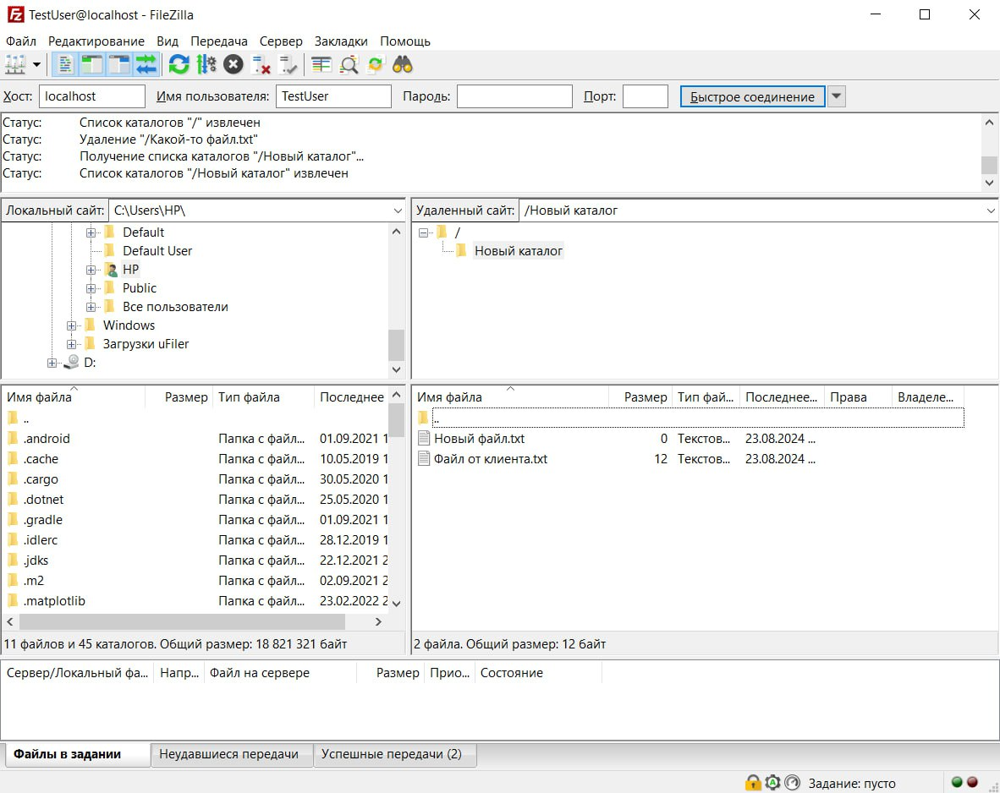
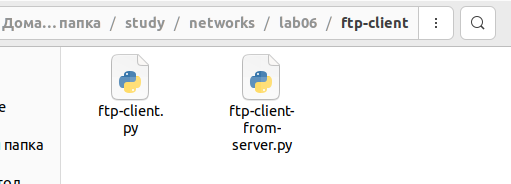

## Программирование. FTP

### FileZilla сервер и клиент (3 балла)
1. Установите сервер и клиент [FileZilla](https://filezilla.ru/get)
2. Создайте FTP сервер. Например, по адресу 127.0.0.1 и портом 21. 
   Укажите директорию по умолчанию для работы с файлами.
3. Создайте пользователя TestUser. Для простоты и удобства можете отключить использование сертификатов.
4. Запустите FileZilla клиента (GUI) и попробуйте поработать с файлами (создать папки,
добавить/удалить файлы).

Приложите скриншоты.

#### Скрины

Сервер на винде работает, поэтому это задание я делал на ней.

На линуксе наблюдаются странные баги:
1) Если заходить от имени системного пользователя, всё работает нормально (вроде)
2) Если зайти от имени настраиваемого пользователя и указать в качестве виртуального пути для '/' тоже '/', то из клиента можно прочитать лишь дерево системных каталогов. При любой попытке что-то изменить или посмотреть домашнюю директорию любого пользователя - неизвестная ошибка.
3) Если зайти от имени настраиваемого пользователя и указать в качестве виртуального пути для '/' любую папку кроме '/', то из клиента нельзя прочитать даже список каталогов в ней - неизвестная ошибка.

### FTP клиент (3 балла)
Создайте консольное приложение FTP клиента для работы с файлами по FTP. Приложение может
обращаться к FTP серверу, созданному в предыдущем задании, либо к какому-либо другому серверу 
(есть много публичных ftp-серверов для тестирования, [вот](https://dlptest.com/ftp-test/) один из них).

Приложение должно:
- Получать список всех директорий и файлов сервера и выводить его на консоль
- Загружать новый файл на сервер
- Загружать файл с сервера и сохранять его локально

Бонус: Не используйте готовые библиотеки для работы с FTP (например, ftplib для Python), а реализуйте решение на сокетах **(+3 балла)**.

#### Демонстрация работы
Скрипт: ftp-client/ftp-client.py

С помощью него я загрузил его же код на ftp-сервер, а затем загрузил его обратно.

Так выглядит запуск скрипта:

Вот файл действительно загрузился:

### GUI FTP клиент (5 баллов)
Реализуйте приложение FTP клиента с графическим интерфейсом. НЕ используйте C#.

Возможный интерфейс:

В приложении должна быть поддержана следующая функциональность:
- Выбор сервера с указанием порта, логин и пароль пользователя и возможность
подключиться к серверу. При подключении на экран выводится список всех доступных
файлов и директорий
- Поддержаны CRUD операции для работы с файлами. Имя файла можно задавать из
интерфейса. При создании нового файла или обновлении старого должно открываться
окно, в котором можно редактировать содержимое файла. При команде Retrieve
содержимое файла можно выводить в главном окне.

#### Демонстрация работы
todo
