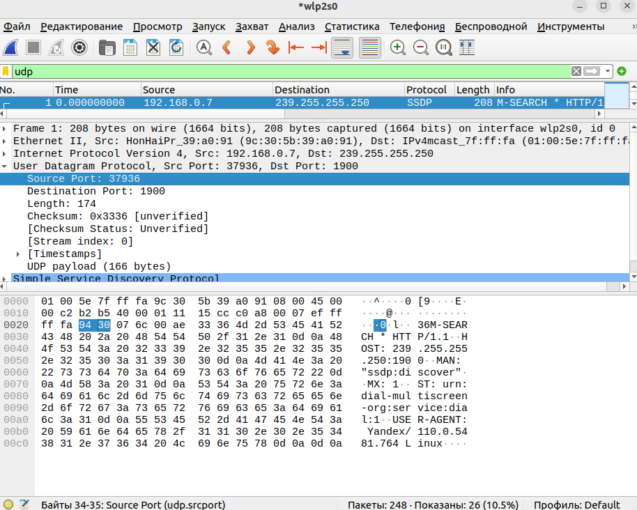
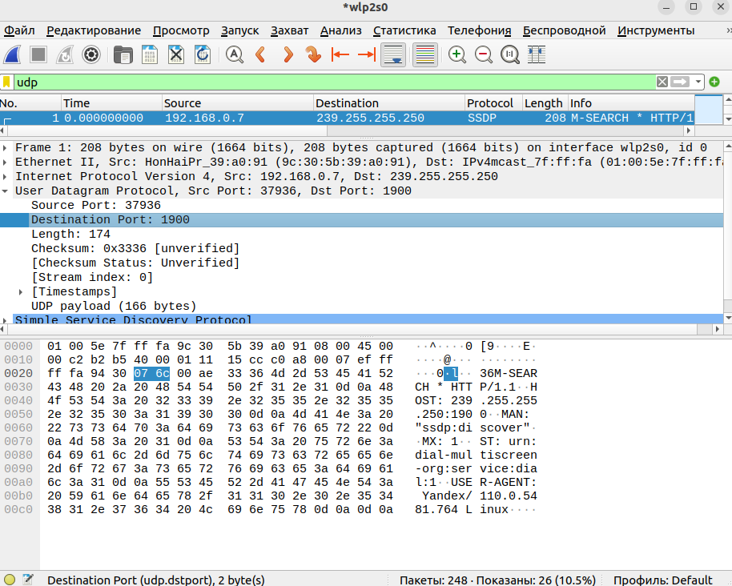
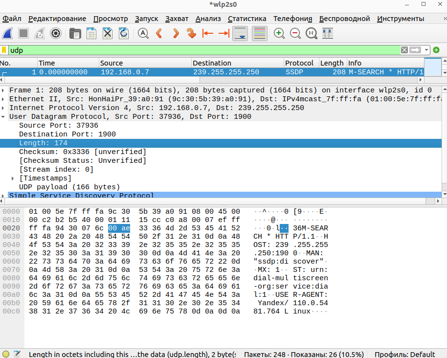
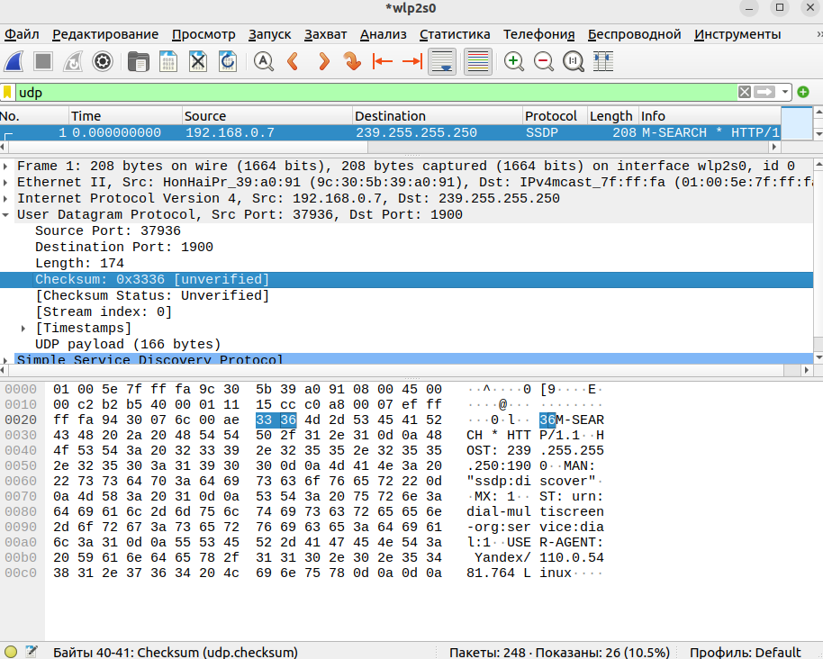
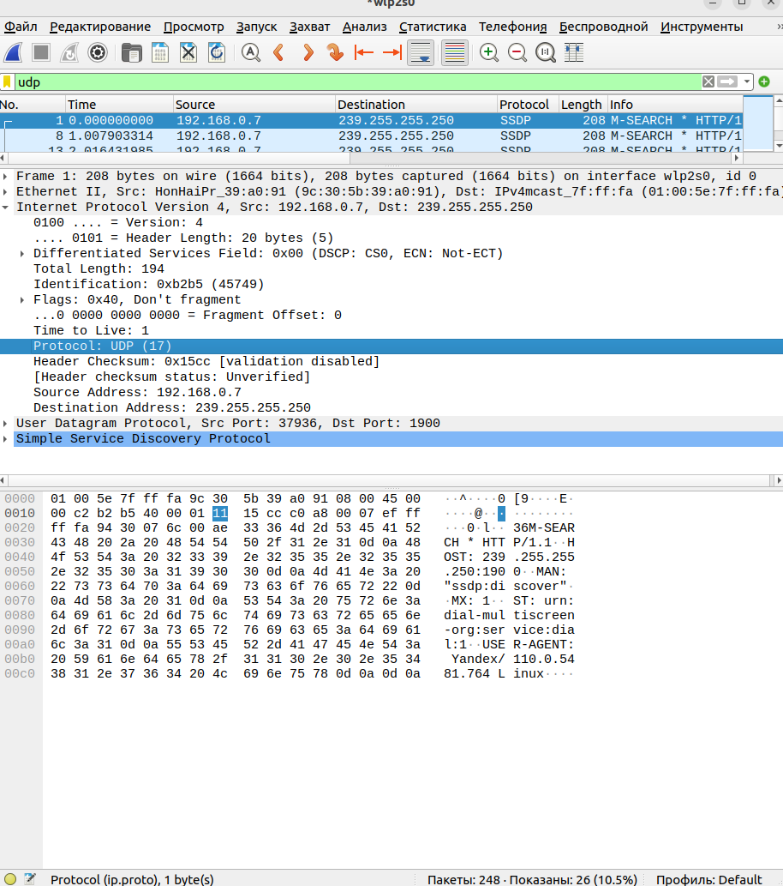
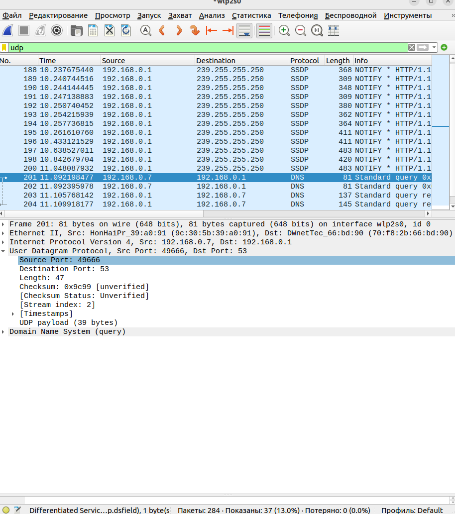
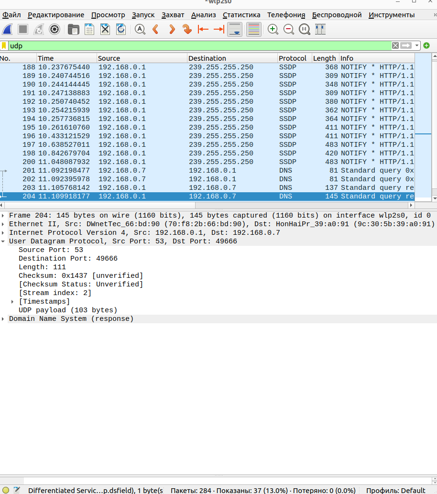

# Практика 6. Транспортный уровень

## Wireshark: UDP (5 баллов)
Начните захват пакетов в приложении Wireshark и затем сделайте так, чтобы ваш хост отправил и
получил несколько UDP-пакетов (например, с помощью обращений DNS).
Выберите один из UDP-пакетов и разверните поля UDP в окне деталей заголовка пакета.
Ответьте на вопросы ниже, представив соответствующие скрины программы Wireshark.

#### Вопросы
1. Выберите один UDP-пакет. По этому пакету определите, сколько полей содержит UDP-заголовок.

   UDP-заголовок содержит 4 поля: порт отправителя, порт получателя, длина, контрольная сумма.
   
   
   
   

2. Определите длину (в байтах) для каждого поля UDP-заголовка, обращаясь к отображаемой
   информации о содержимом полей в данном пакете.

   Каждое поле в заголовке имеет длину 2 байта.

3. Значение в поле Length (Длина) – это длина чего?

   В пакете со скринов длина равна 174. 
   Если отступить такое количество байт с конца данных, мы окажемся ровно на udp заголовка.
   Таким образом, длина - это длина всего udp пакета: заголовка и данных.

4. Какое максимальное количество байт может быть включено в полезную нагрузку UDP-пакета?

   Максимальная длина равна $2^{16}-1$, но это длина всего пакета. 
   Заголовок занимает 8 байт, поэтому максимальная длина данных равна $2^16-9 = 65527$.

5. Чему равно максимально возможное значение номера порта отправителя?
   
   $2^{16}-1 = 65535$

6. Какой номер протокола для протокола UDP? Дайте ответ и для шестнадцатеричной и
   десятеричной системы. Чтобы ответить на этот вопрос, вам необходимо заглянуть в поле
   Протокол в IP-дейтаграмме, содержащей UDP-сегмент.

   Номер протокола udp равен 17 в десятичной системе и 11 в 16-ричной.
   

7. Проверьте UDP-пакет и ответный UDP-пакет, отправляемый вашим хостом. Определите
   отношение между номерами портов в двух пакетах.

   В ответе порты получателя и отправителя поменяны местами.
   
   