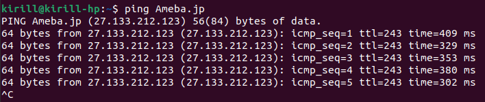
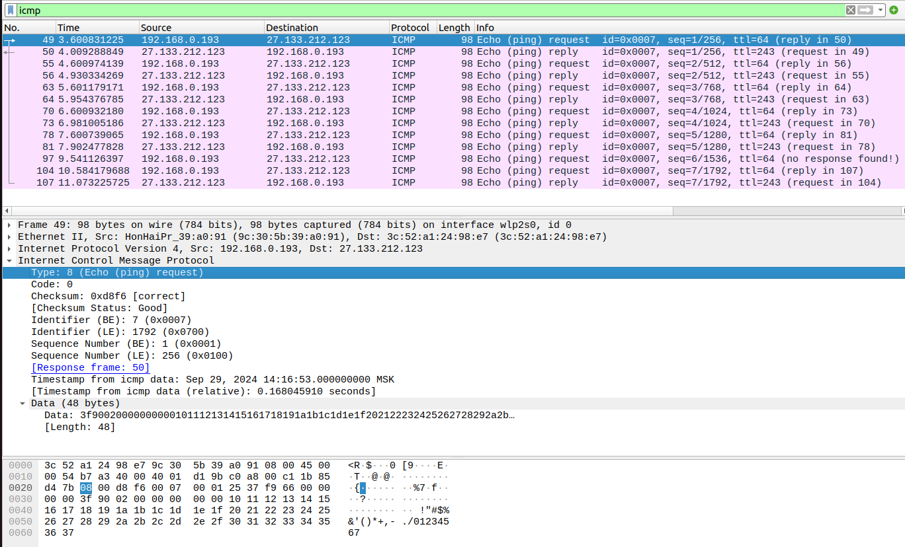
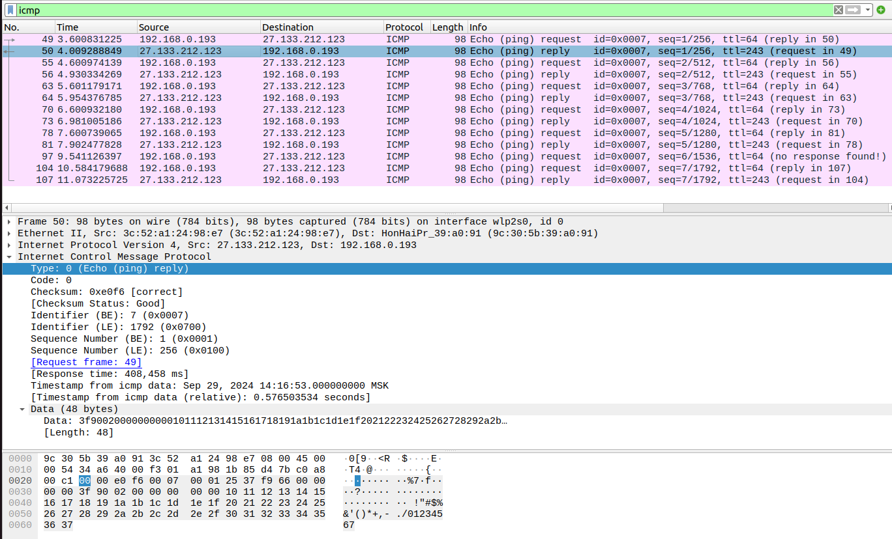
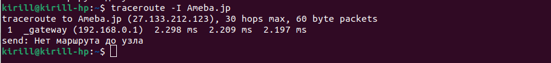
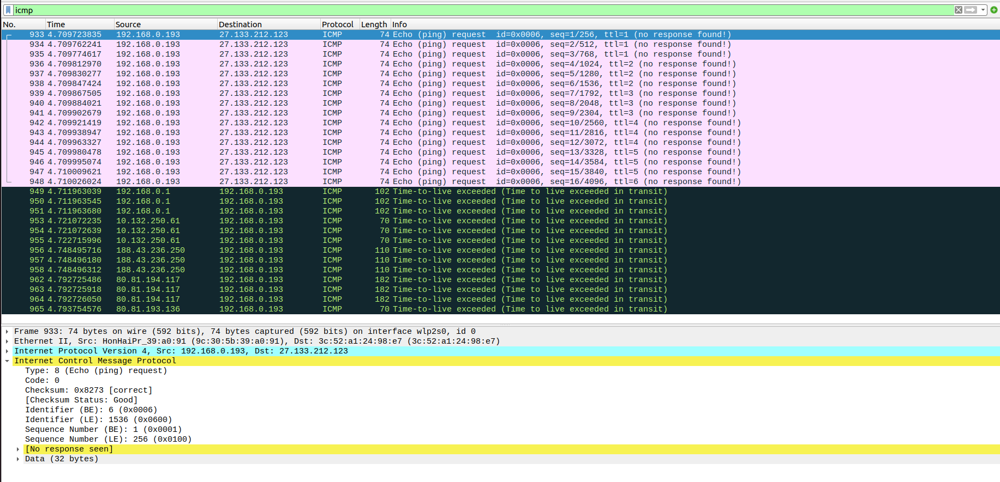
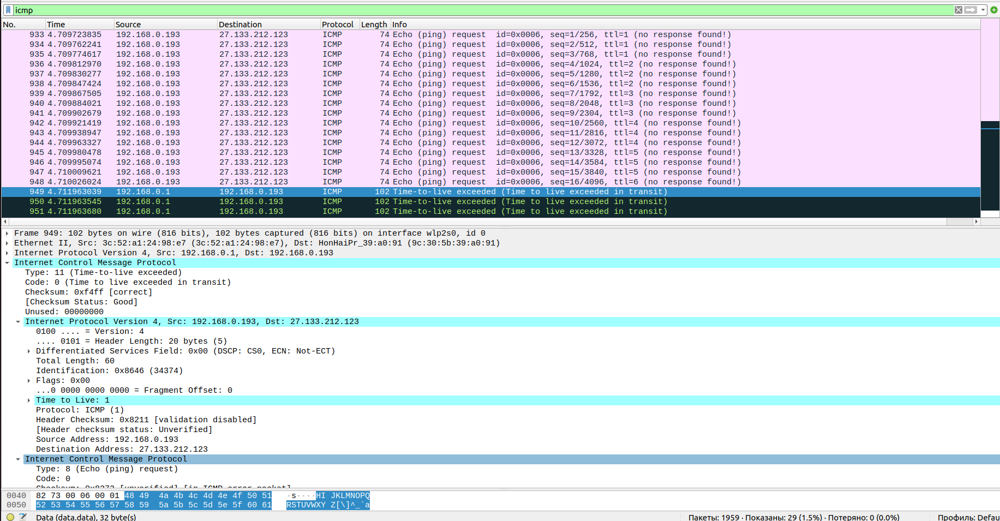
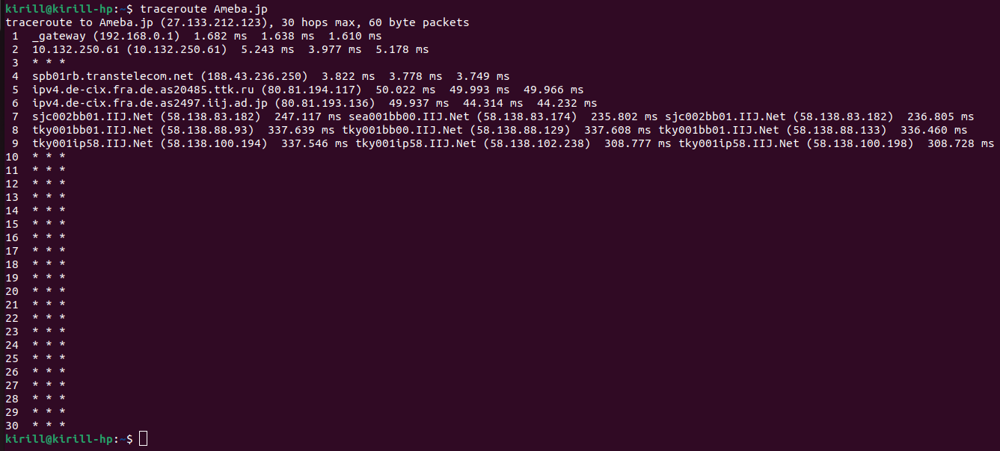

# Практика 9. Сетевой уровень

Сделано:
* всё про wireshark (Ping - 4 балла, Traceroute - 4 балла)

## Wireshark: ICMP
В лабораторной работе предлагается исследовать ряд аспектов протокола ICMP:
- ICMP-сообщения, генерируемые программой Ping
- ICMP-сообщения, генерируемые программой Traceroute
- Формат и содержимое ICMP-сообщения

### 1. Ping (4 балла)
Программа Ping на исходном хосте посылает пакет на целевой IP-адрес; если хост с этим адресом
активен, то программа Ping на нем откликается, отсылая ответный пакет хосту, инициировавшему
связь. Оба этих пакета Ping передаются по протоколу ICMP.

Выберите какой-либо хост, расположенный на другом континенте (например, в Америке или
Азии). Захватите с помощью Wireshark ICMP пакеты от утилиты ping.
Для этого из командной строки запустите команду (аргумент `-n 10` означает, что должно быть
отослано 10 ping-сообщений): `ping –n 10 host_name`

Для анализа пакетов в Wireshark введите строку icmp в области фильтрации вывода.

#### Вопросы
1. Каков IP-адрес вашего хоста? Каков IP-адрес хоста назначения?

   мой IP = 192.168.0.193

   IP сервера Ameba.jp = 27.133.212.123

2. Почему ICMP-пакет не обладает номерами исходного и конечного портов?
   
   ICMP работает поверх IP, а не UDP/TCP. Сам по себе протокол ICMP не предусматривает портов в заголовке, так как ICMP сообщения адресуются не отдельным процессам на хостах, а самим хостам.

3. Рассмотрите один из ping-запросов, отправленных вашим хостом. Каковы ICMP-тип и кодовый
   номер этого пакета? Какие еще поля есть в этом ICMP-пакете? Сколько байт приходится на поля 
   контрольной суммы, порядкового номера и идентификатора?
   
   тип=8, код=0

   Заголовок состоит из полей:
   * тип (1 байт)
   * код (1 байт)
   * контрольная сумма (2 байта)
   * идентификатор (2 байта)
   * номер последовательности (2 байта)

   Затем следуют данные, в моём случае их размер 48 байт.

   

4. Рассмотрите соответствующий ping-пакет, полученный в ответ на предыдущий. 
   Каковы ICMP-тип и кодовый номер этого пакета? Какие еще поля есть в этом ICMP-пакете? 
   Сколько байт приходится на поля контрольной суммы, порядкового номера и идентификатора?

   тип=0, код=0

   остальное такое же как и прошлом задании (поля и их длины те же, длина данных тоже 48 байт)

   

### 2. Traceroute (4 балла)
Программа Traceroute может применяться для определения пути, по которому пакет попал с
исходного на конечный хост.

Traceroute отсылает первый пакет со значением TTL = 1, второй – с TTL = 2 и т.д. Каждый
маршрутизатор понижает TTL-значение пакета, когда пакет проходит через этот маршрутизатор.
Когда на маршрутизатор приходит пакет со значением TTL = 1, этот маршрутизатор отправляет
обратно к источнику ICMP-пакет, свидетельствующий об ошибке.

Задача – захватить ICMP пакеты, инициированные программой traceroute, в сниффере Wireshark.
В ОС Windows вы можете запустить: `tracert host_name`

Выберите хост, который **расположен на другом континенте**.

#### Вопросы
1. Рассмотрите ICMP-пакет с эхо-запросом на вашем скриншоте. Отличается ли он от ICMP-пакетов
   с ping-запросами из Задания 1 (Ping)? Если да – то как?

   Почти не отличается. Есть небольшие отличия вроде данных другой длины, но код и тип такие же, 
   и поля в заголовке соответственно тоже.

   Чтобы traceroute работал с помощью ICMP ping-запросов (видимо это имелось в виду под "эхо-запросами"), а не UDP, я добавил опцию -I.

   
   

2. Рассмотрите на вашем скриншоте ICMP-пакет с сообщением об ошибке. В нем больше полей,
   чем в ICMP-пакете с эхо-запросом. Какая информация содержится в этих дополнительных полях?
   
   Поле с данными содержит первые байты (в моём случае 32 байта) IP-пакета, у которого истёк ttl. 
   В эти байты попадают заголовки IP и ICMP, которые показываются как дополнительные поля.
   
   

3. Рассмотрите три последних ICMP-пакета, полученных исходным хостом. Чем эти пакеты
   отличаются от ICMP-пакетов, сообщающих об ошибках? Чем объясняются такие отличия?
   
   У меня traceroute не смогла найти маршрут до узла, поэтому мои последние три сообщения такие же.
   Я потыкал в разные сайты, и путь до google.com traceroute всё-таки смог найти (но только используя UDP, с ICMP не находит).

   Последние пакеты имеют тип=3 и код=3 и говорят, что мы постучались в не открытый порт.
   Это значит, что пакет дошёл до хоста назначения, но на том хосте порт для этого UDP пакета не открыт.
   Этих пакетов несколько, потому что traceroute отправляет несколько копий пакета (обычно 3) чтобы избежать потери пакета.

   

4. Есть ли такой канал, задержка в котором существенно превышает среднее значение? Можете
   ли вы, опираясь на имена маршрутизаторов, определить местоположение двух маршрутизаторов,
   расположенных на обоих концах этого канала?
   
   Самая большая задержка при первом переходе к маршрутизаторам с адресами *.Net. 
   У предыдущего маршрутизатора был домен .jp, наверное он находится в Японии. 
   Про следующий за ним .Net ничего сказать не могу.

   

## Программирование.

### 1. IP-адрес и маска сети (1 балл)
Напишите консольное приложение, которое выведет IP-адрес вашего компьютера и маску сети на консоль.

#### Демонстрация работы
todo

### 2. Доступные порты (2 балла)
Выведите все доступные (свободные) порты в указанном диапазоне для заданного IP-адреса. 
IP-адрес и диапазон портов должны передаваться в виде входных параметров.

#### Демонстрация работы
todo

### 3. Широковещательная рассылка для подсчета копий приложения (6 баллов)
Разработать приложение, подсчитывающее количество копий себя, запущенных в локальной сети.
Приложение должно использовать набор сообщений, чтобы информировать другие приложения
о своем состоянии. После запуска приложение должно рассылать широковещательное сообщение
о том, что оно было запущено. Получив сообщение о запуске другого приложения, оно должно
сообщать этому приложению о том, что оно работает. Перед завершением работы приложение
должно информировать все известные приложения о том, что оно завершает работу. На экран
должен выводиться список IP адресов компьютеров (с указанием портов), на которых приложение
запущено.

Приложение считает другое приложение запущенным, если в течение промежутка времени,
равного нескольким интервалам между рассылками широковещательных сообщений, от него
пришло сообщение.

**Такое приложение может быть использовано, например, при наличии ограничения на
количество лицензионных копий программ.*

Пример GUI:

#### Демонстрация работы
todo

## Задачи. Работа протокола TCP

### Задача 1. Докажите формулы (3 балла)
Пусть за период времени, в который изменяется скорость соединения с $\frac{W}{2 \cdot RTT}$
до $\frac{W}{RTT}$, только один пакет был потерян (очень близко к концу периода).
1. Докажите, что частота потери $L$ (доля потерянных пакетов) равна
   $$L = \dfrac{1}{\frac{3}{8} W^2 + \frac{3}{4} W}$$
2. Используйте выше полученный результат, чтобы доказать, что, если частота потерь равна
   $L$, то средняя скорость приблизительно равна
   $$\approx \dfrac{1.22 \cdot MSS}{RTT \cdot \sqrt{L}}$$

#### Решение
todo

### Задача 2. Найдите функциональную зависимость (3 балла)
Рассмотрим модификацию алгоритма управления перегрузкой протокола TCP. Вместо
аддитивного увеличения, мы можем использовать мультипликативное увеличение. 
TCP-отправитель увеличивает размер своего окна в небольшую положительную 
константу $a$ ($a > 1$), как только получает верный ACK-пакет.
1. Найдите функциональную зависимость между частотой потерь $L$ и максимальным
размером окна перегрузки $W$.
2. Докажите, что для этого измененного протокола TCP, независимо от средней пропускной
способности, TCP-соединение всегда требуется одинаковое количество времени для
увеличения размера окна перегрузки с $\frac{W}{2}$ до $W$.

#### Решение
todo
