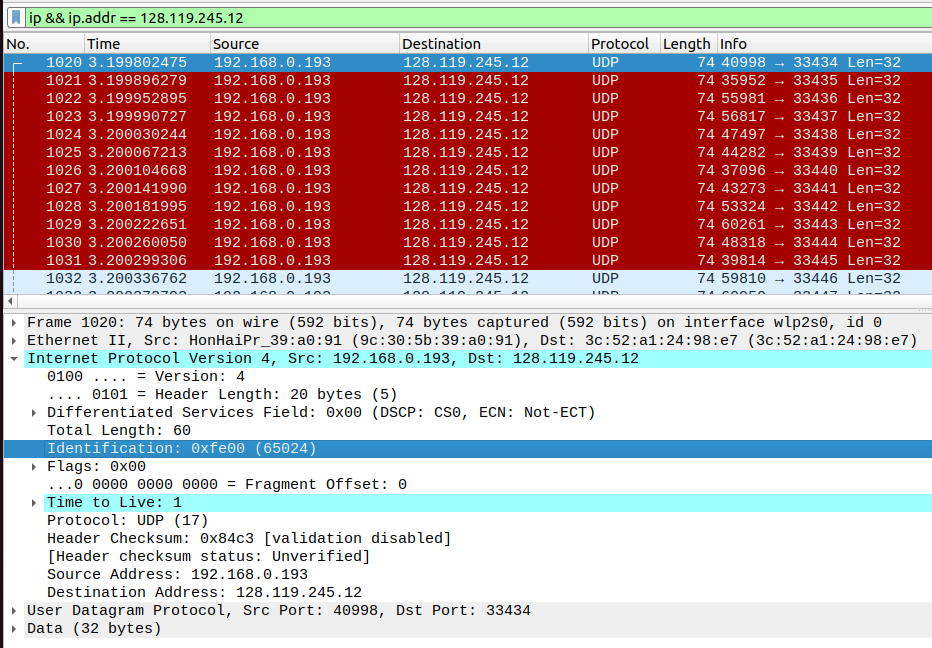
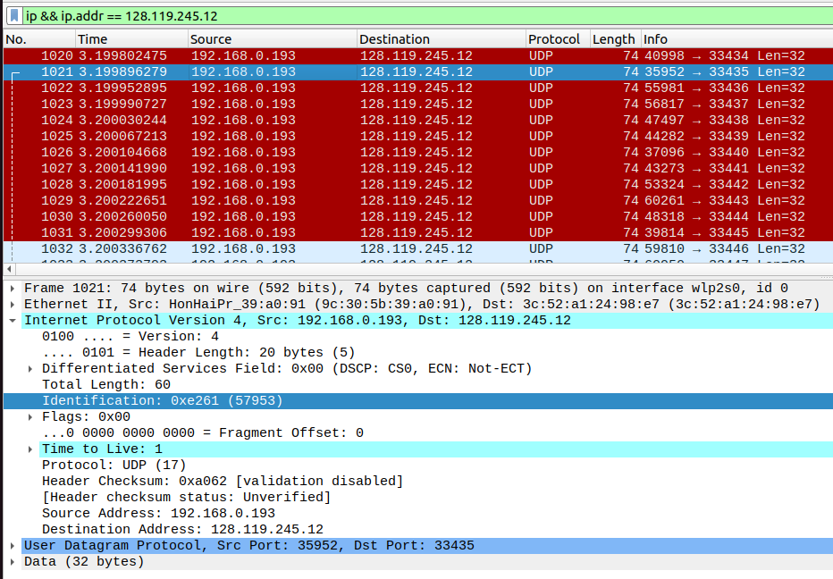
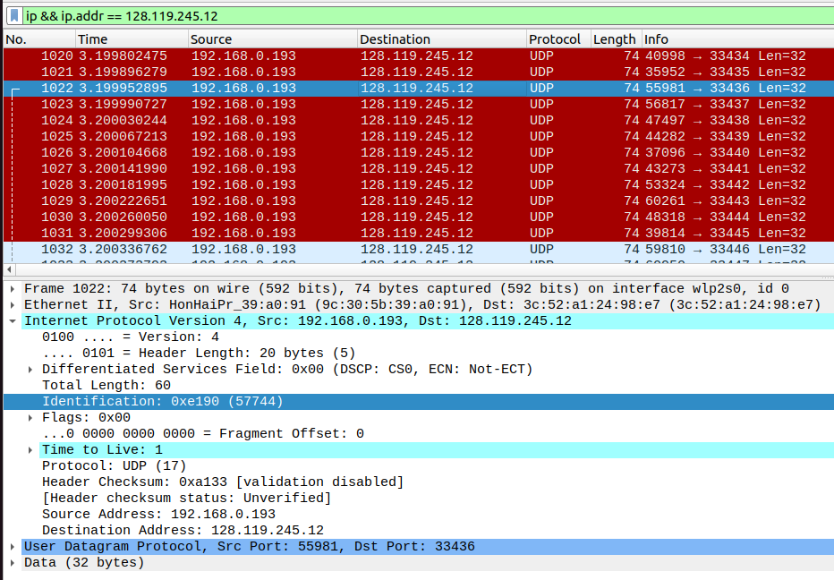
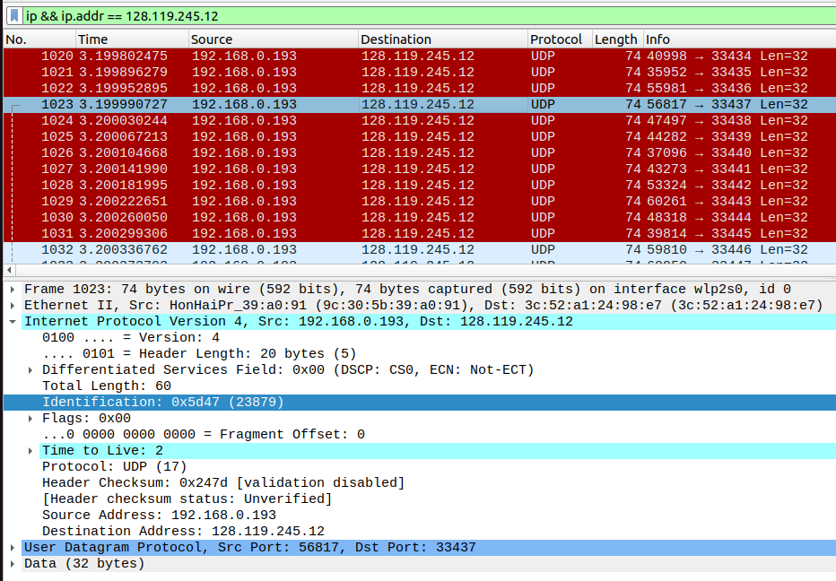
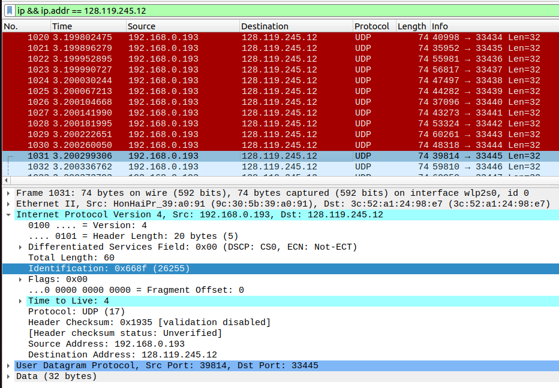
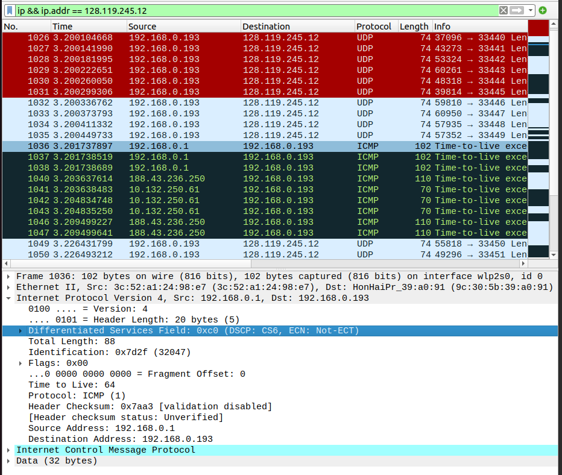
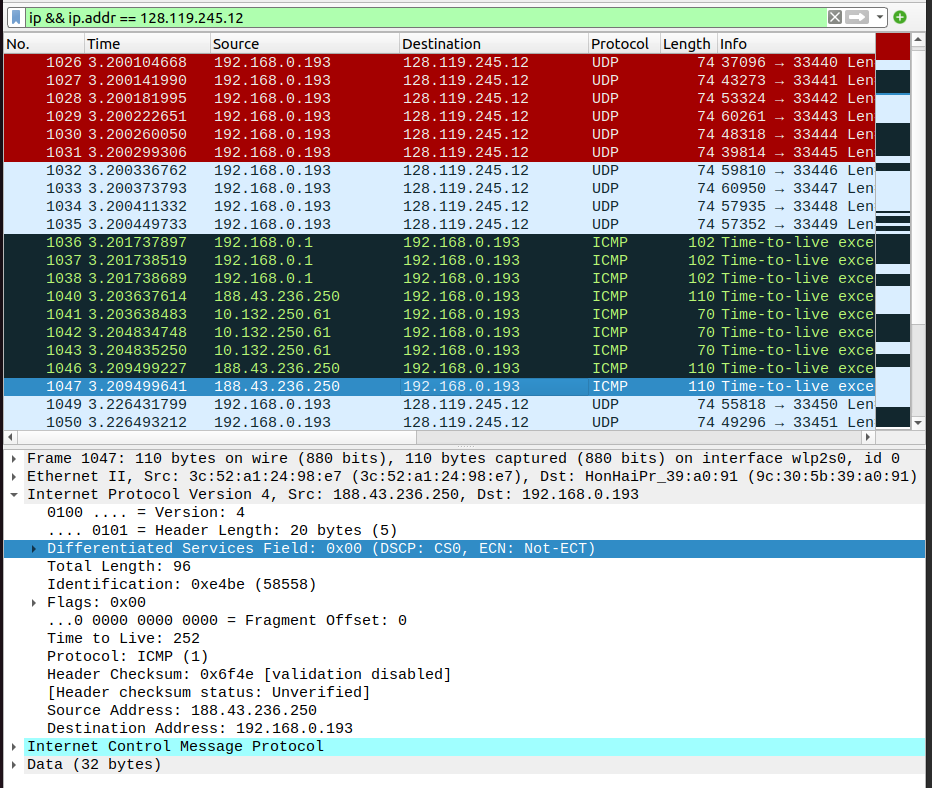
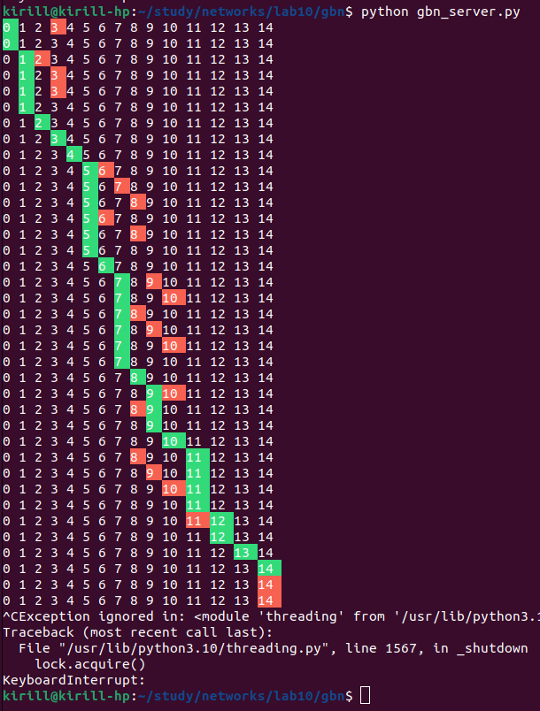

# Практика 10. Сетевой уровень

Сделано:
* Wireshark: IP, кроме фрагментации (8 - <баллы за фрагментацию> баллов)
* go-back-n (8 баллов)

## Wireshark: IP (8 баллов)
Для работы вам понадобится программа traceroute. При работе программа traceroute сначала
отправляет одну или несколько дейтаграмм, причем в поле предписанного времени жизни (TTL) в
IP-заголовке таких дейтаграмм устанавливается значение 1; затем программа посылает одну или
несколько дейтаграмм по тому же адресу, но в поле TTL уже ставится значение 2; далее процесс
повторяется с изменением значения TTL на 3 и т. д.

Маршрутизатор должен уменьшать на единицу значение в поле TTL каждой дейтаграммы,
которую получает. Если значение в поле TTL достигает 0, маршрутизатор возвращает 
ICMP-сообщение (тип 11 – значение TTL исчерпано) хосту-отправителю.

Таким образом хост, на котором выполняется программа traceroute, может узнать
идентификационные данные всех маршрутизаторов между собой и хостом назначения X. Для
этого ему достаточно свериться с IP-адресами источников дейтаграмм, содержащих сообщения
протокола ICMP о том, что их значение TTL достигло нуля.

Вам необходима версия программы traceroute, которая умеет рассылать дейтаграммы разной длины.
- Если вы работаете с Windows:
  Программа tracert, предоставляемая в Windows, не позволяет изменять размер сообщения 
  эхо-запроса ICMP (ping), посылаемого программой tracert. Для этого используйте программу
  [pingplotter](https://www.pingplotter.com/). Размер сообщения ICMP с эхо-запросом можно установить явно,
  выбрав команду меню Edit => Options => Default Settings => Engine, а затем указав значение в поле
  Packet Size.
- Если вы работаете с Unix:
  При помощи команды traceroute из операционных систем Unix можно явно устанавливать размер
  UDP-дейтаграммы, отправляемой на хост назначения (в Unix системах вместо ICMP используется
  UDP). Это значение вводится в командную строку traceroute сразу же за именем или адресом
  хоста назначения. Например, чтобы отправить дейтаграммы traceroute размером 2000 байт на
  адрес gaia.cs.umass.edu, может использоваться следующая команда:
  `traceroute gaia.cs.umass.edu 2000`

#### Подготовка
1. Запустите программу Wireshark и начните захват пакетов.
2. Запустите pingplotter, выберите имя какого-либо целевого хоста (например, akamai.com).
   Запустите трассировку для размера пакета Packet Size = 56 байт.
3. Остановите трассировку Wireshark.

#### Вопросы
В вашей трассе вы должны видеть ряд эхо-запросов по протоколу ICMP (при работе с
Windows) или UDP-сегмент (в случае с Unix).
1. Выберите первое ICMP-сообщение эхо-запроса, отправленное вашим компьютером, и
   раскройте часть информации о пакете Internet Protocol в окне подробной информации.
   Каков IP-адрес вашего компьютера?
   
   Я на линуксе, поэтому это UDP-сообщение.
   Мой IP-адрес - 198.168.0.193.

2. Найдите заголовок IP-пакета. Какое значение указано здесь в поле протокола верхнего уровня?
   
   Протокол верхнего уровня - UDP

3. Сколько байт в IP-заголовке? Сколько байт приходится на полезную нагрузку IP-дейтаграммы?
   
   В IP-заголовке 20 байт

4. Отсортируйте отслеженные пакеты по их исходному IP-адресу; для этого щелкните по
   заголовку столбца Source. Выберите первое сообщение эхо-запроса, отосланное
   вашим компьютером по протоколу ICMP, и раскройте раздел Internet Protocol.
   1. Какие поля IP-дейтаграммы всегда изменяются от одной дейтаграммы к
      следующей в рамках одной последовательности ICMP-сообщений, отсылаемых
      компьютером (последовательность – это все сообщения, которые отправляются до конечного хоста)?
      
      Изменяются поля:
      * Identification
      * Header Checksum
      * Time to Live (меняется не с каждым шагом, а через 3 пакета)

   2. Какие поля не меняются? Какие поля должны оставаться неизменными? Какие
      поля должны изменяться? (в рамках одного запуска утилиты)
      
      Не меняются оставшиеся поля, то есть:
      * Version
      * Header Length
      * Src
      * Dst
      * Protocol
      * ...

      Должны оставаться неизменными только адреса отправителя и получателя.

      Должны изменяться поля Identification и Header Checksum (согласно логике протокола IPv4), а также Time to Live (согласно логике работы утилиты traceroute)

   3. Как изменяется значение поля Identification IP-дейтаграммы с каждым
      последующим эхо-запросом? Есть ли какая-либо закономерность?
      
      Кажется, будто оно выбирается случайно.

5. Какое значение содержится в поле Identification (Идентификация), а какое – в поле TTL
   (выберите какой-либо один пакет ICMP)?
   
   В первом UDP-пакете Identification=65024, а TTL=1.

6. Остаются ли эти значения (Identification и TTL) неизменными во всех сообщениях
   протокола ICMP, где содержится информация об истечении предписанного времени
   жизни; рассмотрите только те из таких сообщений, которые поступили на компьютер с
   ближайшего (первого транзитного) маршрутизатора.
   
   Таких сообщений 3. Во всех TTL=64, а Identification увеличивается на 1 в каждом следующем пакете из этих трёх.

7. Найдите серии откликов ICMP, в которых содержатся сообщения об истечении
   предписанного времени жизни (time-to-live exceeded). Выберите один из пакетов.
   Какое значение содержится в поле Identification (Идентификация), а какое – в поле TTL?
   
   В первом сообщении ICMP об истечении времени жизни (которое от маршрутизатора) TTL=64, а Identification=32047

8. **Фрагментация**. Остановите захват пакетов в Wireshark. Измените размер пакета
   Packet Size = 3500 байт. Снова запустите захват пакетов в Wireshark и перезапустите
   трассировку. (Для Unix заново запустите traceroute с длиной пакета 3500 байт).
   Найдите первое сообщение протокола ICMP с эхо-запросом, поступившее на ваш
   компьютер (с уже измененным размером пакета).
   1. Было ли это сообщение фрагментировано между двумя или более IP-дейтаграммами? 
      Если да, то сколько фрагментов было создано?
      - <!-- todo -->
   2. Какие поля IP-заголовка изменяются в разных фрагментах?
      - <!-- todo -->

## Программирование.

### 1. Эхо-запросы через ICMP (8 баллов)
Реализуйте консольное приложение для эхо-запросов (пингования) с помощью ICMP-запросов и
ответов. Приложение отправляет ICMP-пакеты («эхо-запрос» или «пинг») на целевой хост и
слушает ICMP-ответы («эхо-ответ») от него. Обычно при получении ответов измеряется время
оборота (RTT), фиксируются потери пакетов и выводится статистическая сводка о полученных
ответах (минимальное, максимальное и среднее значение времени оборота, а в некоторых
версиях еще и стандартное отклонение от среднего).

Вам потребуется написать только клиентскую часть программы, а функциональные возможности,
необходимые на стороне сервера, встроены почти во все операционные системы.
Приложение должно отправлять эхо-запросы на определенный хост через одну секунду. Каждое
такое сообщение-запрос содержит данные, которые включают в себя отметку времени. После
отправки каждого пакета приложение ждет получения ответного сообщения в течение одной
секунды. Если ответа нет, то клиент предполагает, что пакет запроса или ответный пакет
были потеряны в сети (или целевой хост недоступен).

В этой работе необходимо будет разобраться с тем, как организовать проверку контрольных сумм
и создание заголовков для ICMP пакетов.

### Задание А (6 баллов)
Реализуйте приложение для эхо-запросов (пингования) с помощью ICMP-запросов и ответов.

Сделайте скриншоты результатов пингования **двух различных** хостов назначения, находящихся
**на разных континентах**.

#### Демонстрация работы
todo

### Задание Б (1 балл)
Организуйте вывод на консоль так, как это сделано в стандартной утилите ping: нужно вывести
минимальное, максимальное и среднее значение RTT в конце каждого ответа от сервера.
Дополнительно вычислите коэффициент потери пакетов (в процентах).

#### Демонстрация работы
todo

### Задание В (1 балл)
Ваша программа обрабатывает только тайм-ауты в получении ICMP-ответов. Добавьте к ней
функционал анализа кодов ошибок протокола ICMP и вывод соответствующих результатов для
пользователя. Примерами кодов ошибок ICMP являются: 0 – сеть назначения недоступна, 1 – хост
назначения недоступен.

Приложите скриншот вывода одной из ошибок.

#### Демонстрация работы
todo

### Справочная информация о протоколе ICMP

#### ICMP-заголовок

<table>
    <thead>
        <tr>
            <th>Биты</th>
            <th>160-167</th>
            <th>168-175</th>
            <th>176-183</th>
            <th>184-191</th>
        </tr>
    </thead>
    <tbody>
        <tr>
            <td align="center"><b>160</B></td>
            <td align="center">Тип</td>
            <td align="center">Код</td>
            <td align="center" colspan=2>Контрольная сумма</td>
        </tr>
        <tr>
            <td align="center"><b>192</b></td>
            <td align="center" colspan=2>Идентификатор</td>
            <td align="center" colspan=2>Номер последовательности</td>
        </tr>
    </tbody>
</table>

ICMP-заголовок начинается после 160-го бита IP-заголовка
- Тип – тип сообщения ICMP
- Код – подтип заданного типа
- Контрольная сумма – вычисляемые для всего ICMP-пакета целиком данные для проверки
ошибок. При вычислении контрольной суммы значение поля полагается равным нулю
- Идентификатор – значение, возвращаемое в случае, когда сообщение является эхо-ответом
- Номер последовательности – значение, возвращаемое в случае, когда сообщение является
эхо-ответом

#### Эхо-запрос
Эхо-запрос – это сообщение ICMP, данные которого должны быть возвращены обратно в эхо-ответе от принимающего хоста.
- Тип ICMP для эхо-запроса равен 8.
- Код устанавливается в значение 0.
- Идентификатор и номер последовательности используются клиентом, чтобы
идентифицировать соответствующие друг другу пары запрос-ответ. На практике
большинство систем семейства Linux используют уникальный идентификатор для каждого
процесса пингования, а номер последовательности – увеличивающееся в течение этого
процесса число.
- Данные, полученные в эхо-запросе, должны полностью быть включены в эхо-ответ.

#### Эхо-ответ
Эхо-ответ – это сообщение ICMP, генерируемое в ответ на эхо-запрос.
- Тип ICMP и код для эхо-ответа устанавливаются в 0.
- Идентификатор и номер последовательности используются клиентом для определения
соответствия пар запрос-ответ.
- Данные, полученные в эхо-запросе, должны полностью быть включены в эхо-ответ.

### 2. Go back-N протокол (8 баллов)
Реализуйте протокол конвейерной передачи данных GBN. Продемонстрируйте работоспособность
вашего решения на примере консольного клиент-серверного приложения, в котором клиент
отправляет серверу файл с данными. Основные шаги при передаче и получении пакетов должны
выводиться в лог. По логу должно быть видно состояние клиента/сервера: какие пакеты находятся
в окне передачи, на какие получены подтверждения, на какие еще нет, а какие еще не переданы.

Приложите файлы с логами клиента и сервера или скрин работы программы.

Пример вывода на консоль приложения, которое было рассмотрено на практике: 

#### Демонстрация работы

Реализация протокола в файле gbn.py. В нём нету установления и разрыва соединения,
только гарантия доставки. Я хотел сделать корректные разрыв соединения, потратил на это пол дня, но наткнулся на неразрешимость задачи о согласии при возможных потерях передачи, и забил на это. 

Передача пакетов в файлах:
* gbn_client.png - отправление
* gbn_server.png - получение

Соединение между ними захардкожено через порты UDP (т.е. как будто оно изначально есть), а разрыва соединения нет, поэтому нужно вручную прерывать выполнение этих скриптов.

Запускать скрипты можно в любом порядке с любым промежутком времени.

